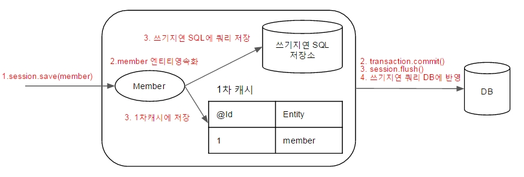
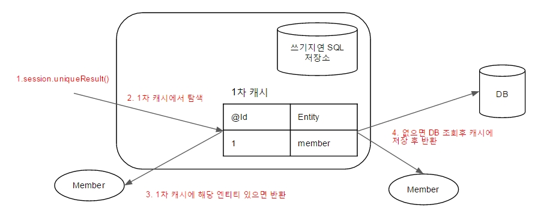
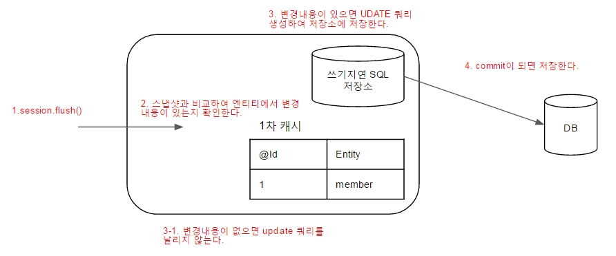

'자바 ORM 표준 JPA 프로그래밍'을 보고 JPA에서 EntityManager에 대해 알아보고, 영속성 관리가 어떻게 이루어지는지 정리한 내용을 포스팅 합니다.


# EntityManagerFactory , EntityManager

* Hibernate에서는 SessionFactory(EntityManagerFactory), Session(EntityManager)으로 불리운다.

* 엔티티 매니저 팩토리는 여러 스레드가 동시에 접근해도 안전하다.(thread-safe)

* 엔티티 매니저는 여러 스레드가 동시에 접근하면 동시성 문제가 발생하므로 스레드 간에 절대 공유하면 안된다.

# 영속성 컨텍스트

* 영속성 컨텍스트란 **엔티티(Entity)를 영구 저장** 하는 환경을 말한다.
엔티티 매니저로 엔티티를 저장하거나 조회하면 엔티티 매니저는 영속성 컨텍스트에 엔티티를 보관하고 관리한다.

* 영속성 컨텍스트는 엔티티 매니저(Session)를 생성할 때 하나 만들어진다. 그리고 엔티티 매니저(Session)를 통해서 영속성 컨텍스트에 접근할 수 있고 영속성 컨텍스트를 관리 할 수 있다.

* 여러 엔티티 매니저(Session)가 같은 영속성 컨텍스트에 접근할 수도 있다.(참고 : 후에 공부할것!) 일단은 하나의 엔티티 매니저에 하나의 영속성 컨텍스트가 만들어진다고 생각하자.

# 엔티티의 생명주기


> * 비영속(new/transient) : 영속성 컨텍스트와 전혀 관계가 없는 상태  
  * 영속(merged) : 영속성 컨텍스트에 저장된 상태
  * 준영속(detached) : 영속성 컨텍스트에 저장되었다가 분리된 상태
  * 삭제(removed) : 삭제된 상태

### 비영속

* **순수한 객체**(아직 영속성 컨텍스트와 연관이 없다) 상태이며 아직 저장하지 않았다.

* 영속성 컨텍스트나 데이터베이스와는 전혀 관련이 없는 상태

### 영속

* 엔티티 매니저(Session)를 통해서 엔티티를 영속성 컨텍스트에 저장했다.

* 영속성 컨텍스트가 관리하는 엔티티를 영속 상태라 한다.

* **ORM을 사용해서 조회한 엔티티** 도 영속성 컨텍스트가 관리하는 **영속 상태** 이다.

``` java
public Member persistence (Member memberPojo) {
  // 파라미터로 받은 memberPojo는 아직까지 순수한 엔티티 이다.
  // (영속성 컨텍스트와는 전혀 관계가 없다.)
  Session session = sessionFactory.getCurrentSession();

  // 아래 과정을 통해서 memberPojo 객체는 영속화 되었다.
  // 이후 코드부터는 영속성 컨텍스트에 의해 관리된다. (영속객체가 되었다.)
  session.persist(memberPojo);

  return memberPojo;
}


// hibernate로 조회한 엔티티도 영속 상태이다.
@Autowried SessionFactory sessionFactory
...

public Member getMember(Long id) {
  Session session = sessionFactory.getCurrentSession();

  // 영속화 된 상태의 Member Entity
  Member member = session.createCriteria(Member.class)
         .add(Restrictions.eq("id", id))
         .uniqueResult();

  return member
}

```

* 영속 상태의 Entity의 setter 메소드를 호출하면 트랜잭션이 끝나는 순간 **DB에 결과가 반영된다.**

### 준영속

* 영속성 컨텍스트가 관리하던 영속 상태의 엔티티를 영속성 컨텍스트가 관리하지 않으면 준영속 상태가 된다.

* session.close() 세션 종료, session.clear() 세션 초기화로 준영속 상태로 만들 수 있다.

### 삭제

* 엔티티를 영속성 컨텍스트와 데이터베이스에서 삭제한다.

# 영속성 컨텍스트의 특징

### 영속성 컨텍스트와 식별자 값(PK)

* 영속성 컨텍스트는 엔티티를 식별자 값(@Id 맵핑)으로 구분한다. (key-value로 관리하는데 이때 key값이 @Id 값이 된다.)

* 영속상태의 엔티티는 반드시 식별자 값이 있어야 한다. (없으면 JPA가 예외를 발생 시킨다.)

### 영속성 컨텍스트와 데이터베이스 저장

* JPA는 보통 트랜잭션을 커밋하는 순간 영속성 컨텍스트에 새로 저장된 엔티티를 데이터베이스에 반영한다.

* 이 과정을 flush라고 한다.

* 플러시는 영속성 컨텍스트의 변경 내용을 데이터베이스에 동기화하는 작업인데 이때 등록, 수정, 삭제한 엔티티를 데이터베이스에 반영한다.

  > (**강조!**) <span style=color:red;>플러시를 영속성 컨텍스트에 보관된 엔티티를 지운다고 생각하면 안 된다! 영속성 컨텍스트에서 변경된 내용을 데이터베이스에 동기화 하는것이 플러시다.</span>


``` java
@Service
// 각 메소드 마다 트랜잭션을 걸어준다.
// 시작점에 transaction.begin(); 끝점에 transaction.commit()이 달린다고 생각하자.
@Transactional
public class MemberServiceImpl implements MemberService {
  ...
  @Override
  public void putMember(Member newMember) {
      // newMember : 영속화 되지 않은 엔티티
      // member : 영속 상태 엔티티(영속 컨텍스트에 의해서 관리된다.)
      Member member = memberRepository.getMember(newMember.getId());

      // 영속 컨텍스트에 의해서 관리되기 때문에 값을 바꾸어주면 쿼리를 캐시한다. (쓰기 지연 SQL 저장소)
      // 메소드가 끝나면 transaction 이 끝나면서 session.flush()가 일어나면서 update 쿼리가 반영된다.
      member.update(newMember);
  }
}
```

### 영속성 컨텍스트가 엔티티를 관리하면 아래와 같은 장점이 있다.

  * 1차 캐시, 동일성 보장, 트랜잭션, 변경감지, 지연로딩

# 예제를 통한 영속성 상태 보기

Member Entity를 이용한 간단한 RestAPI(저장, 조회, 수정)를 통해서 영속화의 과정을 살펴보고자 합니다.
동작은 `RestController -> Service -> Repository` 순으로 이루어지며 Service 딴에는 @Transactional 어노테이션이 있어 Service에 등록된 각 메소드에서 transaction을 시작하고 종료합니다.


> * [**`@transactional`**](http://blog.jhades.org/how-does-spring-transactional-really-work/) 의 동작원리에 대한 링크입니다.
> * 영속화의 과정을 살펴보기 위해 작성한 샘플코드는 [**`깃주소`**](https://github.com/wckhg89/hibernate) 에서 확인할 수 있습니다. (예제는 하이버네이트를 이용해서 작성으며 Member Entity에 관련하여 CRUD를 하는 간단한 REST-API입니다.)

### Member Entity 저장

영속화 되지 않은 Member 엔티티를 Client로 부터 받아서 이를 영속화 시키며 DB에 저장되는 과정 까지를 설명합니다.



``` java
// POST : localhost:9000/api/v1/members
// member JSON : {id : 1, memberId :'zumgu',  password : '123', name : 'kanghonggu', email : 'wckhg89@gmail.com'}

// Controller
@PostMapping("")
public ResponseEntity<String> saveMember(@RequestBody Member member) {
    // 1. 파라미터로 받은 member 엔티티는 아직 영속화 되지 않은 상태입니다.
    memberService.saveMember(member);

    return new ResponseEntity<>(Const.UPDATE_SUCCESS, HttpStatus.OK);
}

// Service
// 서비스 최상단에는 @Transactional이 선언되어 있어, begin()과 commit()으로 감싸져 있습니다.
@Override
public void saveMember(Member member) {
    // transaction.begin()
    // 2 .영속상태 이전의 member 엔티티를 Repository에 전달해줍니다.
    memberRepository.saveMember(member);
    // transaction.commit()
    // 4. 트랜잭션이 커밋되며, Repository에서 영속화된 member 엔티티가 flush() 과정을 통해서 DB에 반영됩니다.
}


// Repository
@Override
public void saveMember(Member member) {
    // sessionFactory에서 session을 가져옵니다.
    // 예제처럼 간단한 코드에서는 하나의 세션(EntitiyManager)는 하나의 영속성 컨텍스트를 가집니다.
    Session session = sessionFactory.getCurrentSession();
    // 3. session.save(member) 과정을 통해서 member 엔티티는 영속화 되었고, 1차 캐시에 엔티티가 등록되며 쓰기지연 SQL 저장소에 저장 쿼리가 등록 되었습니다.
    session.save(member);
}

```

### Member Entity 조회



멤버 엔티티를 조회해오는 과정을 설명합니다. 엔티티를 조회할때, 이미 영속 컨텍스트에서 관리되고 있는 엔티티인지 확인을 먼저합니다. 만일 관리되고 있는 엔티티일 경우 DB 조회 없이 1차캐시에서 해당 결과를 리턴해줍니다. 만일 아직 영속화 되지 않은 엔티티라면 DB에서 조회를 해와서 1차 캐시에 저장을 하며 해당 엔티티를 영속화 시킨 후 결과를 반환해 줍니다.

> **조회한 엔티티는 영속성 컨텍스트에 의해서 관리** 된다는 사실이 중요합니다. 이 다음 과정인 수정 단계에서는 조회한 Member 엔티티를 수정하는데 이 과정에서 변경감지 (dirty checking)이 일어나서 수정사항을 DB에 반영합니다.

``` java
// GET : localhost:9000/api/v1/members/1

// Controller
@GetMapping("/{id}")
public ResponseEntity<Member> getMember(@PathVariable Long id) {
    Member member = memberService.getMember(id);

    return new ResponseEntity<>(member, HttpStatus.OK);
}

// Service
@Override
public Member getMember(Long id) {
    return memberRepository.getMember(id);
}

// Repository
@Override
public Member getMember(Long id) {
    Session session = sessionFactory.getCurrentSession();

    Member member = (Member) session.createCriteria(Member.class)
                        .add(Restrictions.eq("id", id))
                        .uniqueResult();

    return member;
}

```

### Member Entity 수정



JPA 는 엔티티를 영속성 컨텍스트에 보관할 때, 최초 상태를 복사해서 저장해 두는데 이것을 스냅샷이라 합니다. 그리고 플러시 시점에 스냅샷과 엔티티를 비교해서 변경된 엔티티를 찾습니다. 만일 스냅샷과 비교하여 변경된 내용이 있을 경우 update Query를 날립니다. (변경 감지는 영속성 컨텍스트가 관리하는 영속 성태의 엔티티에만 적용이 됩니다.)


``` java
// Member Entity Update Method
public void update(Member newMember) {
    this.name = StringUtils.isEmpty(newMember.name) ? this.name : newMember.name;
    this.password = StringUtils.isEmpty(newMember.password) ? this.password : newMember.password;
    this.email = StringUtils.isEmpty(newMember.email) ? this.email : newMember.email;
}
```


``` java
// PUT : localhost:9000/api/v1/members
// member JSON : {id : 1, memberId : 'zumgu', password : '321', name : 'kanghong9', email : 'wckhg89@zum.com'}

// Controller
@PutMapping("")
public ResponseEntity<String> putMember(@RequestBody Member member) {
    memberService.putMember(member);

    return new ResponseEntity<>(Const.UPDATE_SUCCESS, HttpStatus.OK);
}

// Service
@Override
public void putMember(Member newMember) {
    // 영속 상태 (영속 컨텍스트에 의해서 관리됩니다.)
    Member member = memberRepository.getMember(newMember.getId());
    // 스냅샷과 비교하여 변경된 내역이 있을경우 Update 쿼리를 실행하고 그렇지 않으면 쿼리를 수행하지 않는다.
    member.update(newMember);
}

// Repository
@Override
public Member getMember(Long id) {
    Session session = sessionFactory.getCurrentSession();

    Member member = (Member) session.createCriteria(Member.class)
                        .add(Restrictions.eq("id", id))
                        .uniqueResult();

    return member;
}
```

# 마치며

회사에서 하이버네이트를 쓰면서 영속성에 관한 개념을 잘모르고 하이버네이트(JPA)를 사용하니
불편한 부분이 많아 이번기회에 정리를 시작하였습니다. (예상치 못한 부분에서 Update 쿼리가 날라가는 등..)
아직 확실하게 개념이 잡히지는 않았지만 정리를 하며 어느정도는 영속화에 대해서 알게 된것 같습니다. 영속성 개념은 항상 숙지하기 위해서 정리를 해두고 틈틈이 확인하고자 합니다. 
