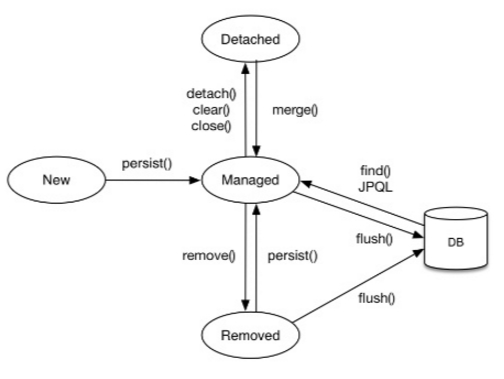

'자바 ORM 표준 JPA 프로그래밍'을 보고 JPA에서 EntityManager에 대해 알아보고, 영속성 관리가 어떻게 이루어지는지 정리한 내용을 포스팅 합니다.


# EntityManagerFactory , EntityManager

* Hibernate에서는 SessionFactory(EntityManagerFactory), Session(EntityManager)으로 불리운다.

* 엔티티 매니저 팩토리는 여러 스레드가 동시에 접근해도 안전하다.(thread-safe)

* 엔티티 매니저는 여러 스레드가 동시에 접근하면 동시성 문제가 발생하므로 스레드 간에 절대 공유하면 안된다.

# 영속성 컨텍스트

* 영속성 컨텍스트란 **엔티티(Entity)를 영구 저장** 하는 환경을 말한다.
엔티티 매니저로 엔티티를 저장하거나 조회하면 엔티티 매니저는 영속성 컨텍스트에 엔티티를 보관하고 관리한다.

* 영속성 컨텍스트는 엔티티 매니저(Session)를 생성할 때 하나 만들어진다. 그리고 엔티티 매니저(Session)를 통해서 영속성 컨텍스트에 접근할 수 있고 영속성 컨텍스트를 관리 할 수 있다.

* 여러 엔티티 매니저(Session)가 같은 영속성 컨텍스트에 접근할 수도 있다.(참고 : 후에 공부할것!) 일단은 하나의 엔티티 매니저에 하나의 영속성 컨텍스트가 만들어진다고 생각하자.

# 엔티티의 생명주기



> * 비영속(new/transient) : 영속성 컨텍스트와 전혀 관계가 없는 상태  
  * 영속(merged) : 영속성 컨텍스트에 저장된 상태
  * 준영속(detached) : 영속성 컨텍스트에 저장되었다가 분리된 상태
  * 삭제(removed) : 삭제된 상태

### 비영속

* **순수한 객체**(아직 영속성 컨텍스트와 연관이 없다) 상태이며 아직 저장하지 않았다.

* 영속성 컨텍스트나 데이터베이스와는 전혀 관련이 없는 상태

### 영속

* 엔티티 매니저(Session)를 통해서 엔티티를 영속성 컨텍스트에 저장했다.

* 영속성 컨텍스트가 관리하는 엔티티를 영속 상태라 한다.

* **ORM을 사용해서 조회한 엔티티** 도 영속성 컨텍스트가 관리하는 **영속 상태** 이다.

``` java
public Member persistence (Member memberPojo) {
  // 파라미터로 받은 memberPojo는 아직까지 순수한 엔티티 이다.
  // (영속성 컨텍스트와는 전혀 관계가 없다.)
  Session session = sessionFactory.getCurrentSession();

  // 아래 과정을 통해서 memberPojo 객체는 영속화 되었다.
  // 이후 코드부터는 영속성 컨텍스트에 의해 관리된다. (영속객체가 되었다.)
  session.persist(memberPojo);

  return memberPojo;
}


// hibernate로 조회한 엔티티도 영속 상태이다.
@Autowried SessionFactory sessionFactory
...

public Member getMember(Long id) {
  Session session = sessionFactory.getCurrentSession();

  // 영속화 된 상태의 Member Entity
  Member member = session.createCriteria(Member.class)
         .add(Restrictions.eq("id", id))
         .uniqueResult();

  return member
}

```

* 영속 상태의 Entity의 setter 메소드를 호출하면 트랜잭션이 끝나는 순간 **DB에 결과가 반영된다.**

### 준영속

* 영속성 컨텍스트가 관리하던 영속 상태의 엔티티를 영속성 컨텍스트가 관리하지 않으면 준영속 상태가 된다.

* session.close() 세션 종료, session.clear() 세션 초기화로 준영속 상태로 만들 수 있다.

### 삭제

* 엔티티를 영속성 컨텍스트와 데이터베이스에서 삭제한다.

# 영속성 컨텍스트의 특징

### 영속성 컨텍스트와 식별자 값(PK)

* 영속성 컨텍스트는 엔티티를 식별자 값(@Id 맵핑)으로 구분한다. (key-value로 관리하는데 이때 key값이 @Id 값이 된다.)

* 영속상태의 엔티티는 반드시 식별자 값이 있어야 한다. (없으면 JPA가 예외를 발생 시킨다.)

### 영속성 컨텍스트와 데이터베이스 저장

* JPA는 보통 트랜잭션을 커밋하는 순간 영속성 컨텍스트에 새로 저장된 엔티티를 데이터베이스에 반영한다.

* 이 과정을 flush라고 한다.

``` java
@Service
// 각 메소드 마다 트랜잭션을 걸어준다.
// 시작점에 transaction.begin(); 끝점에 transaction.commit()이 달린다고 생각하자.
@Transactional
public class MemberServiceImpl implements MemberService {
  ...
  @Override
  public void putMember(Member newMember) {
      // newMember : 영속화 되지 않은 엔티티
      // member : 영속 상태 엔티티(영속 컨텍스트에 의해서 관리된다.)
      Member member = memberRepository.getMember(newMember.getId());

      // 영속 컨텍스트에 의해서 관리되기 때문에 값을 바꾸어주면 쿼리를 캐시한다.
      // 메소드가 끝나면 transaction 이 끝나면서 session.flush()가 일어나면서 update 쿼리가 반영된다.
      member.update(newMember);
  }
}
```

### 영속성 컨텍스트가 엔티티를 관리하면 아래와 같은 장점이 있다.

  * 1차 캐시, 동일성 보장, 트랜잭션, 변경감지, 지연로딩

영속화의 과정을 살펴보기 위해 작성한 샘플코드는 [`깃주소`](https://github.com/wckhg89/hibernate) 에서 확인할 수 있습니다. (예제는 하이버네이트를 이용해서 작성했습니다.)
