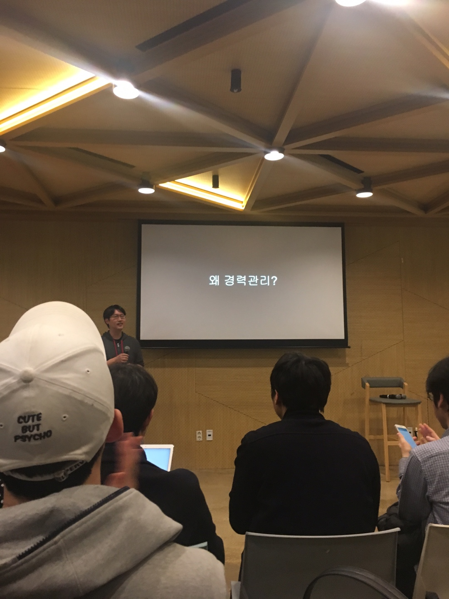
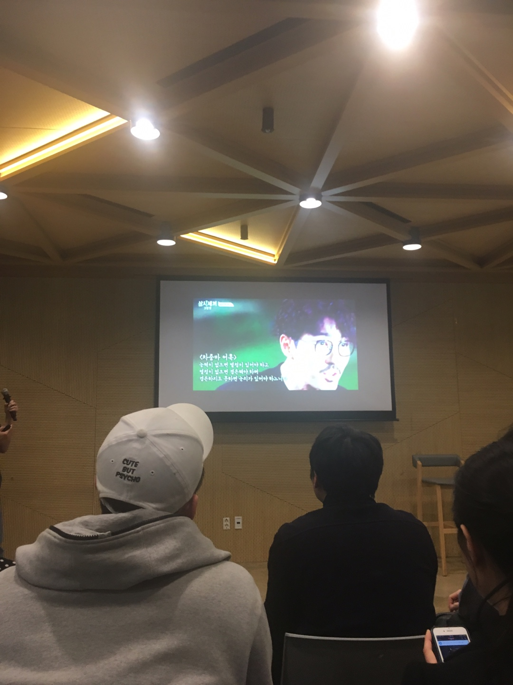
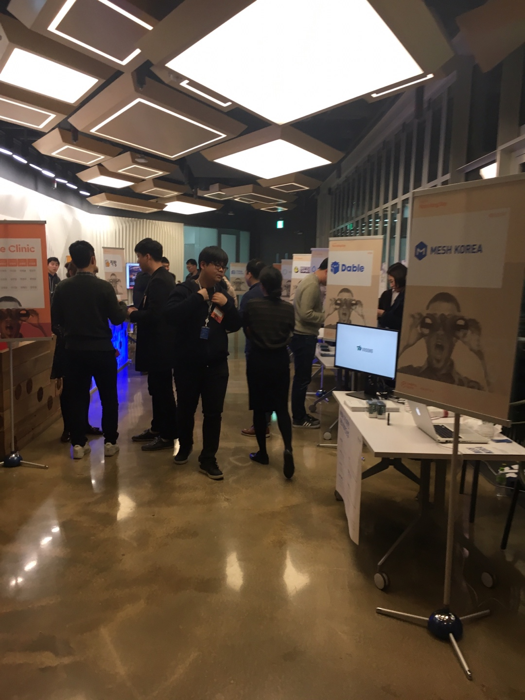
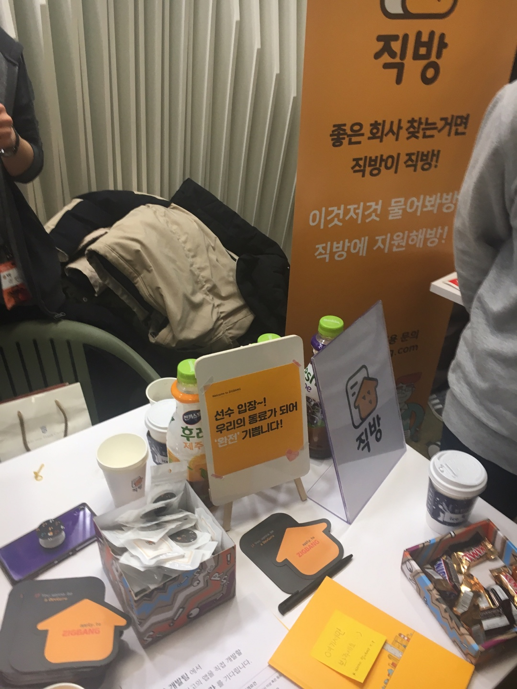
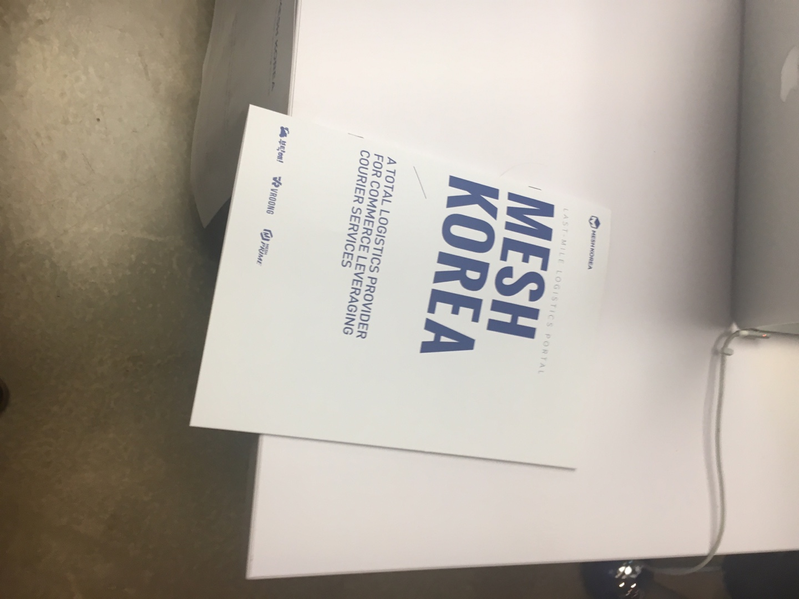
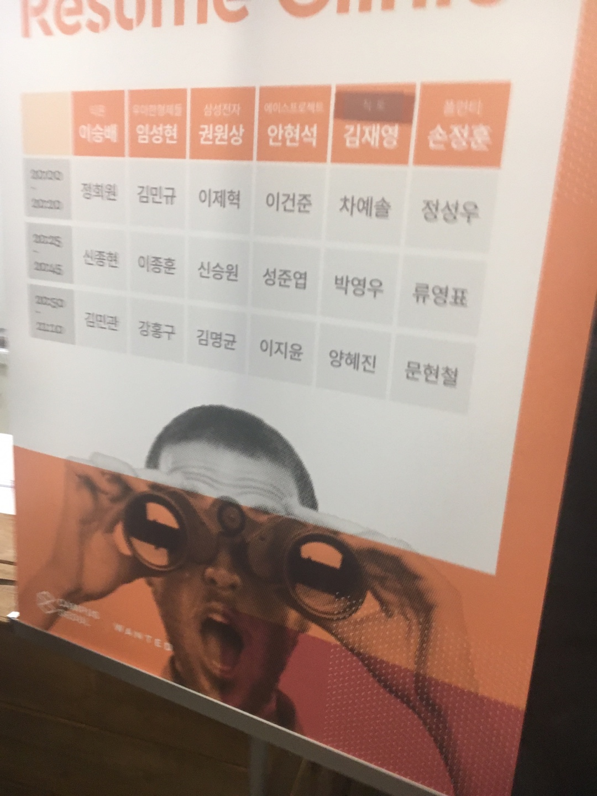
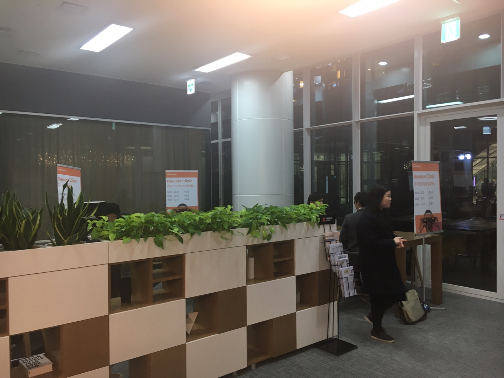
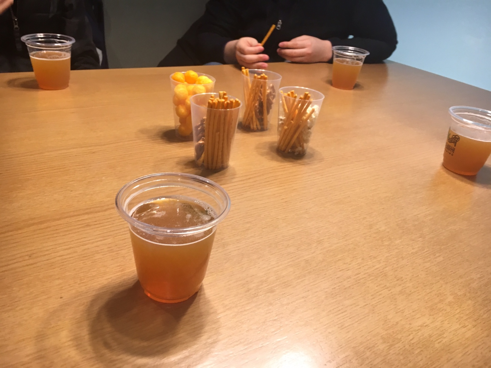

오늘은 구글 캠퍼스 서울 x 원티드에서 주관한 리쿠르팅 데이에 다녀왔습니다. 다른 회사들의 문화가 어떤지 궁금하고 현재 나는 개발자로서 잘 하고 있나 궁금하여 다른 회사들의 소개 부스도 구경하고 이력서 첨석도 받고 왔습니다. 너무나도 즐거웠던 이번 리쿠르팅 데이의 후기를 남겨봅니다!

# 개발자 커리어 Talk

행사를 시작하며 현재 구글에서 근무중이신 양찬석님의 개발자로서 커리어 경력 관리에 대해서 발표를 해주셨습니다. 개발자로서 스스로의 경력을 관리하여 기회가 있을때, 자신을 표현할 수 있도록 계속 준비해야 한다고 말씀해주셨습니다.

* 왜 경력관리? (양찬석 님 (구글 <- 빙글 <- 삼성))

  

  * 내가 개발자의길을 가면서 어느 정도까지 와있는지 궁금하다.

  * 그래서 경력관리가 중요하다고 생각한다.

  * IT직종 평균 연속 근년수 : 8년 (표본 : 상장된 대기업)

  * 2006 ~ 2010 : 5년간 평균 3번 정도의 이직을 했다.

    * 그래서 경력관리가 필요하다.

  * 어떻게 하면 이직을 잘 할 수 있을까 ?

    * 내가 가고싶은 곳이 있을때, 마침 거기서 **나를 필요로 할때**

    * 그래서 경력관리는 남들이 나를 필요로 할때, 나를 표현할 수 있는 수단

    * 모아나 영화로 비유

      * 왜이렇게 미친짓 하고 다녀 -> 마을에 미친노인이 내일 이니까

        * 다른 사람의 시선이 중요한게 아니다.

    * 답정남 / 답정녀 : 누구의 의견을 듣고싶겠지만 사실은 나 스스로 결정은 되어있다.

  * 이직을 하기 위해 필요한 준비는 무엇일까?

    * 실력

      * 개발 직종에는 초고수가 진짜 많다. (개발을 좋아하는 사람이 진짜 많다.)

      * 커뮤니티 활동을 정기적으로 하는게 실력 향상에 큰 도움이 된다.

      * 다른 사람의 코드를 가져다 쓰되 왜 이런 의도로 사용했는지 생각하자.

    * 이력서 관리

      * 이력서에 자신의 실력을 들어낼 수 있도록 해야한다.

      * 블로그, 개인 프로젝트, 오픈 소스 활동을 통해서 나를 알리자

    * 영어

      * 우리의 세컨드 랭귀지는 영여여야 했다.. 생각하지 않게 영어 공부도 꾸준히 필요하다

    * 운

      * 위에가 준비되었다면 운이 좋기를 기다려 보자.

      * 운 앞에서는 겸손하자.

    * 인맥

      * 가장 강력한 무기 -> 지인 추천!

      * 인맥은 태도라고 생각한다.

        * **같이 일하고 싶은 사람이 되어야 한다.**

      * 차줌마 어록

        

        > 능력이 없으면 열정이 있어야하고  
        열정이 없으면 겸손해야 하며  
        겸손하지 못하면 눈치가 있어야 하느니라

* TL;DR; (Too Long Don't Read : 세줄 요약)

  * 앞으로 일할 날이 많기 떄문에, 이직을 해야한다. 이직을 위해서는 경력관리는 꾸준히하여, 나와 일하고 싶은 사람이 되어가야 한다.

* Q&A

  * 많은 이직을 통해서 무엇을 얻고자 하는지

    * 동일한 유사한 일을 하다보면 그 일이 익숙해진다. 어느 순간 부뎌지는 순간이 무섭다 (더 발전이 없어서...) 나보다 뛰어난 사람이 나오면 내가 뒤쳐질까 두려워서 이직을 통해 새로운 일을 하면서 계속해서 나를 발전시키고 싶다.

  * 링크드인 통계를 보면서 평균 이직수가 늘어나고 있는데, 그 이유가 무엇이라고 생각하는지

    * 통계를 어떻게 해석하는지의 관점, 기술의 발전 속도가 빨라지니 개발자들도 계속 성장해야하니까 이직을 통해서 자기를 발전한다고 생각한다.
    (어디까지나 발표자분 의견)

# 회사 홍보 부스

양찬석님의 발표를 듣고 여러 회사의 홍보부스를 구경했습니다. 부스를 소개하는 분들과 이야기를 나누며 다른 회사들의 개발 스택도 알아볼 수 있었고 회사의 문화 등 여러가지를 즐겁게 이야기를 나누었습니다.

제가 관심있게 이야기를 나눈 부스는 ``직방`` 과 ``MESH 코리아`` 라는 두 회사였습니다.

> 여러 회사에서 홍보를 해주었는데, 어떤 방식으로 홍보부스를 마련하는 지 궁금하여 주최측인 원티드 담당자분께 여쭤보았습니다. 원티드에서 이런 행사가 있다는 것을 홍보해주시고 추첨을 통하여 **전액 무료** 로 부스를 마련해 주신다하였습니다. 자신의 회사를 홍보하고자 한다면 이런 행사에 적극적으로 참여해보는 것도 정말 좋은 방법인 것 같다고 생각했습니다.

먼저 직방은 서버개발을 노드JS로 바꾸어나가고 있는 과정이라 했는데 흥미로웠던 것은 AWS 람다 서비스를 통해서 서버리스 아키텍쳐를 도입중이라 하였습니다.

> 많은 준비를 한것이 한눈에 느껴지는 부스였습니다. (한켠으로는 부러웠습니다..)

그리고 MESH 코리아와 같은 경우는 여러 백앤드 개발 환경이있는데 자바 개발자인 저는 자바 개발 환경이 궁금하여 이 부분에 관심있게 이야기를 나누었습니다. 개발환경이 ``스프링부트``, ``JPA (QueryDSL)``, ``DDD``등 최신의 기술을 적극적으로 사용하고 있어 굉장히 놀랐고 흥미로웠습니다. 개발문화도 서로 스터디를 하며 성장하고자 노력하고 있다하여 저도 회사내에 그런 문화를 만들기 위해 노력해야겠다는 생각을 한편으로 하게 되었습니다.

> 새로운 기술을 적극적으로 반영하고자 노력하는 MESH 코리아도 굉장히 인상깊었습니다.

# Resume Clinic

홍보부스에서 회사를 적극적으로 홍보해주시는 담당자분들과 즐겁게 말씀을 나누고 미리 신청했던 이력서 첨석 차례가되어 이력서 첨석을 받고 왔습니다.

> 무려 우아한형제들의 임성현님께서 첨석을 해주셨습니다! (이력서 첨석안내 전화를 받고부터 얼마나 설례였는지 모릅니다.)

아쉽게도 제가 작성한 이력서가 제대로 첨부가 안되었는지 프린팅이 제대로 되지 않아 이력서에 대해서는 제대로 첨석을 받지 못하였습니다.

그러나 그보다 더 귀한 좋은 말씀을 너무 많이 들었습니다. 제가 요근래 힘들었던 것은 잦은 조직개편으로 팀내 개발 문화를 정착시키기 어려운 부분이 안타깝고 힘들었습니다. 이런 부분을 중심으로 어떻게 해 나가야 할지 말씀을 나누었습니다. 회사는 회사일뿐 나 또한 회사에서 얻을 수 있는것을 중심으로 생각을하여 나를 키워야 한다는 말씀이 주된 내용이었습니다.

그동안 회사에서도 충분히 할 수 있는게 많은데 좋은 환경 속에서도 그렇게 하지 못했던 자신을 스스로 반성했고 앞으로는 조금 더 적극적인 자세로 새로운 것을 시도해봐야겠다는 생각을 했습니다.

그 외에도 약 30분가량 개발자로서 성장하기 위해 어떻게 해야할지 좋은 말씀을 많이 들었습니다. 정말 너무 소중한 시간이였습니다.

* 나도 회사를 이용해야한다.

* 가고 싶어하는 회사에서 나를 원하게 해야한다.

  * 컨퍼런스등 모임을 통해 가고자 하는 회사의 사람을 많이 만나 나를 어필하자

  * 가고자하는 회사에 내가 어떻게 녹아들어 갈 수 있을지를 나타내자

* 개발자 이력관리

  * 내가 했던 일을 상세히 정리하자

    * 이벤트는 어느정도 규모인지

    * 프로젝트 규모는 어느정도 였는지

    * 프로젝트를 통해서 스스로 얻은게 무엇인지

* 컨퍼런스에서 발표를 해보는 것도 나를 알리는 좋은 방법이다.

* 회사에서 서비스 운영, 서비스 런칭을 모두 해볼 수 있는 회사는 많지 않다.

  * 개발 스택을 자유롭게 선택 할 수 있는 회사도 흔치 않다.

  * 회사에서 내가 할 수 있는것이 무엇인지 찾아 나를 계속 발전 시켜야한다. (회사는 회사일 뿐이다. 최대한 이용해야한다.)

> 많은 분들이 이력서 첨석을 받았는데 정말 그 열정이 대단해 보였습니다.

# 네트워킹 파티

마지막으로 시원한 맥주와 맛있는 과자를 먹으며 네트워킹 파티를 했습니다.
주말에 스터디를 함께하는 분들과 회사 동기 예전의 회사 선배분과 즐겁게 이야기를 나누며 네트워킹 파티를 즐겼습니다.

재밌게 이야기를 나누고 있을때, 개발에 관심있는 다른 분이 함께 말씀 나누고 싶다고 하셔 더더더 즐겁게 말씀을 나누며 즐겁게 네트워킹 파티를 즐겼습니다.

> 그동안 만나보지 못했던 다양한 많은 사람들을 만날 수 있다는 것이 컨퍼런스 네트워킹 파티의 큰 묘미가 아닐까 생각합니다. 이런 분들을 통해서 다시금 열정이 생기고 자극이 되는 것 같습니다.

# 마무리

올해 첫 컨퍼런스를 다녀왔습니다. 연초에는 컨퍼런스가 많지 않아 빨리 컨퍼런스가 열리기를 기다렸는데 역시나 가슴을 뜨겁게 해주는 너무나도 즐거운 시간이였습니다. 앞으로 **내가 할 수 있는것에 집중하며 즐겁게 개발을 할 수 있는 개발자가 되어야겠다** 는 생각을 많이 했습니다.

정말 너무 소중하고 즐거운 시간이였습니다. 이상 이번 리쿠르팅데이의 후기였습니다!
