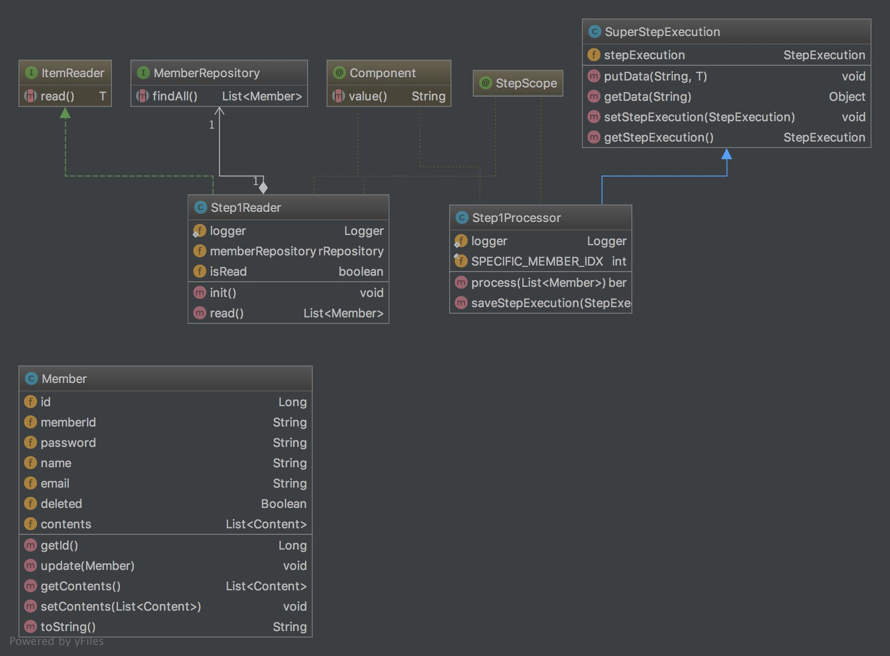
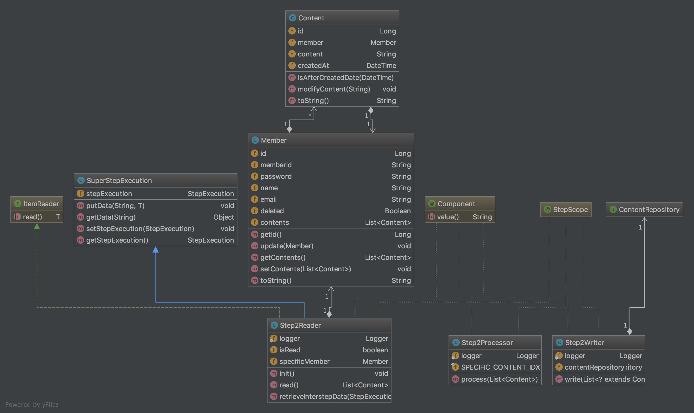

회사에서 스프링 배치를 이용한 배치성 프로그램을 제작을 하게 되었습니다.
스프링배치를 많이 다뤄본 경험이 부족하여 이번 프로젝트를 진행하며 많은 삽질을 경험했는데,
삽질 내용을 남기고자 포스팅을 시작합니다. 총 3편으로 포스팅을 진행하려 합니다.


# 시작하며

스프링 배치는 하나의 Job이 복수개의 Step을 가지는 구조로 동작을 시킬 수 있습니다.
각각의 Step별로 해주는 역할을 명확히 나누고자 Step을 여러개로 분리하였는데, 이로 인해서 Step간에 데이터를
공유해야하는 이슈가 생겼습니다.

Step 간의 데이터를 공유하는 과정에서 StepExecution을 이용하여 ExecutionContext에 공유하고자 하는 데이터를
저장해 놓고 사용하는 방식으로 진행했는데, 이때 Spring Batch Meta Data를 저장하는 이슈를 고려하지 못해
여러가지 삽질을 경험했습니다.

이번에 경험한 삽질을 총 3번의 포스팅을 통해서 기록으로 남기고자 합니다.

오늘 포스팅에서는 ``첫번째 내용``으로 스프링 배치에서 Step 간의 데이터 공유에 대해서 포스팅을 하고자 합니다.
그리고 ``두번째 내용``으로는 Batch Schema를 커스터마이징하는 방법에 대해서 포스팅 하고자 합니다.
마지막으로 ``세번째 내용``은 StepExecution을 사용함으로 인해서 Batch Meta-data를 저장하면서 성능이슈(Meta-data를 저장하며 Serialize 및 DB IO로 인한 성능 저하 이슈)가 발생하는 현상과 StepExecution을 이용하지 않고 Step간의 데이터를 공유하는 방법을 포스팅하려 합니다.

> 1. Spring Batch StepExecution을 이용한 Step간의 데이터 공유  
  2. Spring Batch Schema Customizing 방법  
  3. StepExecution을 이용함으로 나타나는 성능이슈 및 StepExecution을 이용하지 않는 Step간 데이터 공유

# 프로젝트 구조

예제 소스는 [깃주소](https://github.com/wckhg89/spring-batch-practice)에서 확인하실 수 있습니다.

먼저 시나리오는 하나의 ``job`` 이 ``step1``과 ``step2``를 가지고 있습니다.

``step1``은 Step1Reader가 회원들을 조회해 와서 Step1Processor에 넘겨주게 됩니다. Step1Processor는 회원 목록중 첫번째 회원을 ``StepExecution``의 ``ExecutionContext``에 저장해 줍니다.



> Step1 클래스 다이어그램

``step2``의 Step2Reader에서는 첫번째 회원을 ``step1``에서 저장한 첫번째 회원을 ``ExecutionContext``에서 가져와서 첫번째 회원이 작성한 첫번째 게시물을 Step2Processor에 넘겨줍니다.

Step2Processor에서는 첫번째 게시물을 수정하여 Step2Writer에 넘겨주고 Step2Writer에서는 변경된 내용을 DB에 저장해주는 시나리오로 예제를 구성했습니다.



> Step2 클래스 다이어그램


# Step간 데이터 공유

프로젝트 구조를 설명하며 데이터의 흐름을 보았습니다. 이제 코드를 보면서 실제로 Step1과 Step2에서 데이터 공유를 어떻게 했는지 살펴보고 자 합니다.

먼저 Step 간의 데이터 공유를 위해서는 ``StepExecution``의 ``ExecutionContext`` 객체에 데이터를 key, value 형태의 맵에 저장해서 공유가 되어집니다.

그렇기 때문에는 데이터를 공유하고자 하는 step들에게는 ExecutionContext를 들을수 있는 리스너를 등록해 주어야 합니다.
그때 사용되어지는 Bean객체가 ``ExecutionContextPromotionListener`` 입니다. 해당 빈을 설정해주는 코드는 아래와 같습니다.

``` java

@Bean
public ExecutionContextPromotionListener promotionListener () {
    ExecutionContextPromotionListener executionContextPromotionListener = new ExecutionContextPromotionListener();
    // 데이터 공유를 위해 사용될 key값을 미리 빈에 등록해주어야 합니다.
    executionContextPromotionListener.setKeys(new String[]{"SPECIFIC_MEMBER"});

    return executionContextPromotionListener;
}

```

> 코드의 주석에서 보이는 것 처럼 공유를 위해 사용하고자 하는 데이터의 key값을 빈을 정의할 때 미리 리스너에 등록해 주어야 합니다.

``ExecutionContextPromotionListener`` 빈을 등록해주었으면
데이터 공유를 하고자하는 step 빈을 만들때 등록한 리스너 빈을 주입해주어야 합니다.

``` java
@Bean
public Step step1 () {
    return stepBuilderFactory.get("step1")
            .<List<Member>, Member>chunk(1)
            .reader(step1Reader())
            .processor(step1Processor())
            // lister 등록
            .listener(promotionListener())
            .build();
}

@Bean
public Step step2 () {
    return stepBuilderFactory.get("step2")
            // commit-interval은 트랜잭션이 커밋되기 직전까지 처리되는 item의 수를 의미한다.
            .<List<Content>, Content>chunk(1)
            .reader(step2Reader())
            .processor(step2Processor())
            .writer(step2Writer())
            // lister 등록
            .listener(promotionListener())
            .build();
}

```

지금까지 step간 데이터를 공유하기 위해서 기본적인 설정하는 방법을 보았습니다. 그럼 이제 어떻게 StepExecution에 데이터가 들어가고 나오는지 코드를 통해 살펴 보겠습니다.

저는 데이터를 공유하기 위해 StepExecution을 사용하고자 하는 객체에서 ``SuperStepExecution`` 이라는 이름의 클래스를 상속하여 공통적이 기능을 사용 할 수 있도록 하나의 클래스를 만들었습니다.


``` java

/**
 * Created by kanghonggu on 2017. 3. 15..
 */
public class SuperStepExecution <T> {
    private StepExecution stepExecution;

    protected void putData(String key, T data) {
        if (this.stepExecution == null) {
            throw new NullPointerException("StepExecution is null");
        }

        ExecutionContext stepContext = this.stepExecution.getExecutionContext();
        stepContext.put(key, data);
    }

    protected Object getData(String key) {
        if (this.stepExecution == null) {
            throw new NullPointerException("StepExecution is null");
        }

        JobExecution jobExecution = stepExecution.getJobExecution();
        ExecutionContext jobContext = jobExecution.getExecutionContext();

        return jobContext.get(key);
    }

    protected void setStepExecution(StepExecution stepExecution) {
        this.stepExecution = stepExecution;
    }

    protected StepExecution getStepExecution() {
        return this.stepExecution;
    }
}

```

> SuperStepExecution 클래스는 StepExecution을 세팅해주고 가져오고 데이터를 가져오는 등의 공통된 역할을 수행하는 클래스 입니다.

먼저 StepExecution에 첫번째 회원 데이터를 세팅해주는 ``Step1Processor``를 보겠습니다.

``` java

@Component
@StepScope
public class Step1Processor extends SuperStepExecution<Member>
        implements ItemProcessor<List<Member>, Member> {

    private static Logger logger = LoggerFactory.getLogger(Step1Processor.class);

    private final int SPECIFIC_MEMBER_IDX = 0;

    @Override
    public Member process(List<Member> item) throws Exception {
        logger.info("Step1 Processor 시작");
        Member specificMember = item.get(SPECIFIC_MEMBER_IDX);

        logger.info("Step1 Processor 첫번째 회원 정보 : {}", specificMember);

        // 2. SuperStepExecution의 StepExecution에 데이터 세팅
        super.putData("SPECIFIC_MEMBER", specificMember);

        return specificMember;
    }

    @BeforeStep
    public void saveStepExecution(StepExecution stepExecution) {
      // 1. SuperStepExecution의 멤버변수에 stepExecution 주입
        super.setStepExecution(stepExecution);
    }
}

```

코드에서 보는것 처럼 @BeforeStep을 통해 ``SuperStepExecution``클래스의 멤버변수에 StepExecution을 주입 시켜주었습니다.

그리고 실제 process 메소드에서 첫번째 회원 데이터를 세팅해주고 있습니다.


이제 마지막으로 Step1 에서 세팅한 데이터를 Step2에서 어떻게 꺼내서 사용하는데 코드를 살펴보겠습니다.

``` java

@Component
@StepScope
public class Step2Reader extends SuperStepExecution<Member> implements ItemReader<List<Content>> {

    private static Logger logger = LoggerFactory.getLogger(Step2Reader.class);
    private boolean isRead;
    private Member specificMember;

    @PostConstruct
    public void init () {
        isRead = false;
    }

    @Override
    public List<Content> read() throws Exception, UnexpectedInputException, ParseException, NonTransientResourceException {

        logger.info("Step2 Reader 시작");
        if (!isRead) {
            isRead = true;
            List<Content> contentList = this.specificMember.getContents();

            logger.info("Step2 Reader 첫번째 회원의 게시글 수 : {}", contentList.size());

            return contentList;
        }

        return null;
    }

    @BeforeStep
    public void retrieveInterstepData(StepExecution stepExecution) {
      // step 실행전 stepExecution을 가져와 등록한 회원 정보를 가져온다.
        super.setStepExecution(stepExecution);
        this.specificMember = (Member) super.getData("SPECIFIC_MEMBER");

    }
}

```

위의 코드에서 처럼 @BeforeStep 을 통해서 Step이 실행전에 step1에서 등록한 회원정보를 가져오고 있습니다.

그리고 실제 read에서는 해당 회원이 작성한 작성글 정보를 가져오고 있습니다.

---


# 마치며

지금까지 살펴본 코드와 같이 step들 간에 데이터 공유가 이루어 질 수 있습니다.

그런데 이런식으로 StepExecution을 사용하여 데이터를 공유할 시 스프링 배치에서는 Batch Schema에 메타데이터 정보를 남겨주게 됩니다.

따라서 공유하고자하는 데이터의 크기가 클 경우에는 데이터 사이즈를 초과하는 에러등 여러가지 이슈가 발생 할 수 있습니다.

다음 포스팅에서는 이러한 이슈를 대응하고자 Batch Schema를 커스터마이징 하는 과정에 대해서 글을 써보고자 합니다.
