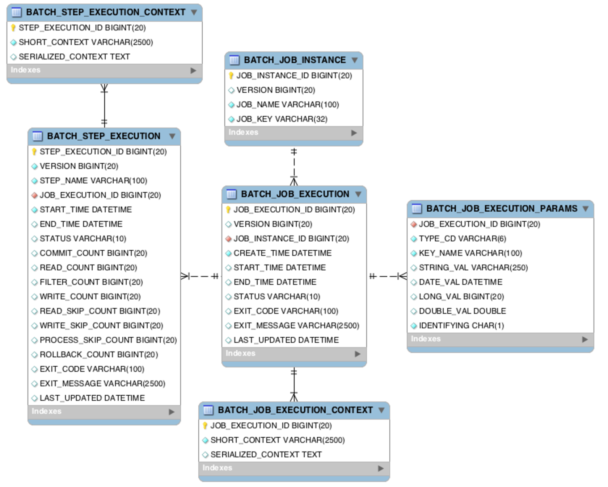

회사에서 스프링 배치를 이용한 배치성 프로그램을 제작을 하게 되었습니다.
스프링배치를 많이 다뤄본 경험이 부족하여 이번 프로젝트를 진행하며 많은 삽질을 경험했는데,
삽질 내용을 남기고자 포스팅을 시작합니다. 총 3편으로 포스팅을 진행하려 합니다.

# 시작하며

스프링배치는 아래와 같은 테이블구조로 메타데이터를 자동으로 관리해 줍니다. 따라서 배치를 시작할때 자동으로 ``org.springframework.batch.core`` 패키지에 있는 ``schema-*.sql`` 파일을 참조해서 스키마를 디자인 해주게 됩니다.

> 출처 : http://docs.spring.io/spring-batch/reference/html/metaDataSchema.html

오늘 포스팅에서는 스프링 배치 Meta-data Schema를 커스터마이징 하는 방법에 대해서 알아보고자 합니다.

# 
