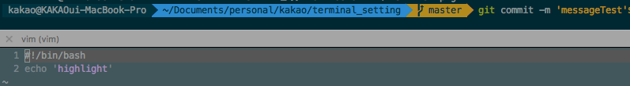

# OSX iterm2 터미널 세팅 가이드

- ``oh-my-zsh`` & ``zsh-syntax-highlighting`` & ``erics_vim_syntax_and_color_highlighting`` 적용 가이드 문서입니다.

- 세팅 완료시 아래와 같은 이미지로 터미널이 세팅됩니다.




### 사전 작업

- OSX에서 외부 패키지를 설치할 수 있도록 해주는 ``Homebrew``를 먼저 설치 해줘야합니다.
- 아래 링크를 따라서 ``Homebrew``를 설치합니다.
- [설치가이드 링크](https://brew.sh/index_ko.html)

### zsh 설치

- zsh을 설치해 줍니다.

```terminal
> brew install zsh
> zsh --version
zsh 5.3.1 (x86_64-apple-darwin16.6.0)
```

> 위와 같이 설치 ``zsh --version``명령어 실행 후 버전 확인이 되면 zsh 설치가 완료됩니다.

### 기본 shell 변경
- OSX 초기 shell은 bash-shell로 되어 있을텐데 해당 shell을 z-shell로 변경해 줍니다.

  ```terminal
  > which zsh #zsh 위치 확인
  /usr/local/bin/zsh
  > chsh -s /usr/local/bin/zsh #기본 쉘 변경
  Changing shell for kakao.
  Password for kakao:
  chsh: /usr/local/bin/zsh: non-standard shell
  ```

  > 위의 명령어를 참고하여 기본 shell을 zsh로 수정합니다.

  ```terminal
  > echo $SHELL
  /bin/zsh
  ```

  > 터미널 재시작후 기본쉘 변경을 확인합니다.


### oh-my-zsh 적용


- oh-my-zsh 설치
  - ``wget``을 통해서 인스톨을 진행하기위해 설치를 진행합니다.

    ```terminal
    > brew install wget
    > wget
    wget: missing URL
    Usage: wget [OPTION]... [URL]...
    > sh -c "$(wget https://raw.github.com/robbyrussell/oh-my-zsh/master/tools/install.sh -O -)"

    ```

    > 설치 완료후 터미널을 종료하고 실행하면 oh-my-zsh이 적용되어 있습니다.

    - [설치가이드 링크](https://github.com/robbyrussell/oh-my-zsh)

- oh-my-zsh 테마 적용
  - ``~/.zshrc`` 설정파일에(zsh 설정파일) 원하는 테마를 적용해 줍니다.

    ```zsh
    #ZSH_THEME="robbyrussell"
    ZSH_THEME="agnoster"
    ```

    - [테마종류 링크](https://github.com/robbyrussell/oh-my-zsh/wiki/External-themes)

- iterm2 테마 설정

  - [설정가이드 링크](http://thdev.tech/mac/2016/05/01/Mac-ZSH-Install.html)

- font 설정

  - [설정가이드 링크](http://thdev.tech/mac/2016/05/01/Mac-ZSH-Install.html)

### zsh-syntax-highlighting 적용

- ``zsh-syntax-highlighting``을 ``~/.vim``경로에 clone 해줍니다.

  ```terminal
  > brew install zsh-syntax-highlighting
  ```

  > brew를 통해서 ``zsh-syntax-highlighting``을 설치해주면 ``/usr/local/share/zsh-syntax-highlighting/zsh-syntax-highlighting.zsh`` 경로에 설치가 됩니다.

- .zshrc에 하이라이트를 적용해 줍니다.

  ```terminal
  > vim ~/.zshrc
  source /usr/local/share/zsh-syntax-highlighting/zsh-syntax-highlighting.zsh
  # .zshrc 파일의 마지막 부분에 위의 내용을 붙여넣습니다.

  > source ~/.zshrc
  ```

- [설치가이드 링크](https://github.com/zsh-users/zsh-syntax-highlighting/blob/master/INSTALL.md)

### erics_vim_syntax_and_color_highlighting 적용

- ``~/.vim`` 경로에 ``erics_vim_syntax_and_color_highlighting``을 클론 받습니다.
  ```terminal
  > cd ~/.vim
  > git clone https://github.com/sentientmachine/erics_vim_syntax_and_color_highlighting.git
  ```

- ``~/.vimrc``설정 파일에 아래 문구를 붙여넣어 줍니다.


    ```
    "The following three lines map Ctrl+s to save in vi.  You can comment
    "these out, it has nothing to do with syntax highlighting or colors.

    " optional lines to turn on pressing F2 to toggle paste mode
    noremap <F2> :set invpaste paste?<CR>i
    set pastetoggle=<F2>


    :nmap <c-s> :w<CR>
    :imap <c-s> <Esc>:w<CR>a
    :imap <c-s> <Esc><c-s>

    syntax on
    set background=dark
    set hlsearch
    set nu
    " set smartindent  "smartindent doesn't take care of python hashtag comments correctly, use cindent:    
    set cindent
    set tabstop=4
    set shiftwidth=4
    set expandtab
    set cursorline
    filetype on
    filetype plugin indent on

    au BufReadPost,BufNewFile *.twig colorscheme koehler
    au BufReadPost,BufNewFile *.css colorscheme slate
    au BufReadPost,BufNewFile *.js colorscheme slate2
    au BufReadPost,BufNewFile *.py colorscheme molokaiyo
    au BufReadPost,BufNewFile *.html colorscheme monokai
    au BufReadPost,BufNewFile *.java colorscheme monokai
    " au BufReadPost,BufNewFile *.php colorscheme monokai

    " Default line highlighting for unknown filetypes
    hi String ctermfg=140
    hi CursorLine ctermbg=235
    hi CursorLine guibg=#D3D3D3 cterm=none

    "What follows are optional things, I like them

    "au BufNewFile,BufRead *.py
    "        \ set tabstop=4
    "        \ set shiftwidth=4     "aand fedora doesn't like this parameter, remove this line.
    "        \ set textwidth=79
    "        \ set expandtab
    "        \ set autoindent
    "        \ set fileformat=unix

    " Commenting blocks of code.
    " This specifies the comment character when specifying block comments.
    "autocmd FileType c,cpp,java,scala let b:comment_leader = '//'
    "autocmd FileType sh,ruby,python   let b:comment_leader = '#'
    "autocmd FileType conf,fstab       let b:comment_leader = '#'
    "autocmd FileType tex              let b:comment_leader = '%'
    "autocmd FileType mail             let b:comment_leader = '>'
    "autocmd FileType vim              let b:comment_leader = '"'

    "this makes it so you can Shift-V highlight lots of text then press ,cc to
    "comment it or ,cu to uncomment.  
    "noremap <silent> ,cc :<C-B>silent <C-E>s/^/<C-R>=escape(b:comment_leader,'\/')<CR>/<CR>:nohlsearch<CR>
    "noremap <silent> ,cu :<C-B>silent <C-E>s/^\V<C-R>=escape(b:comment_leader,'\/')<CR>//e<CR>:nohlsearch<CR>

    "This mission critical workaround hack tells vim to restore cursor to the last line.
    "Be sure to set: "Thip, crinkle, sploit" to "stopit, just be right".  lolz
    "Also it could be the functionality is disabled in your /etc/vim/vimrc or
    "your ~/.viminfo is owned by root.  
    "http://askubuntu.com/questions/223018/vim-is-not-remembering-last-position
    autocmd BufReadPost *
      \ if line("'\"") > 1 && line("'\"") <= line("$") |
      \   exe "normal! g`\"" |
      \ endif

    "These extra commands tell syntastic to ignore the following kinds of warnings                                                               
    "let g:syntastic_quiet_messages = { "regex": 'superfluous' }
    "let g:syntastic_quiet_messages = { "regex": 'superfluous-parens\|too-many-instance-attributes\|too-few-public-methods' }

    "I like the vertical bar on insert mode, others do not like.  You decide.
    "let &t_SI = "\<Esc>]50;CursorShape=1\x7" " Vertical bar in insert mode
    "let &t_EI = "\<Esc>]50;CursorShape=0\x7" " Block in normal mode
    ```


- ``~/.zshrc``설정 파일에 아래 문구를 붙여 넣습니다.

  ```zsh
  TERM=xterm-256color
  ```

  ```terminal
  > soruce ~/.zshrc
  ```


- [설치가이드 링크](https://github.com/sentientmachine/erics_vim_syntax_and_color_highlighting)
