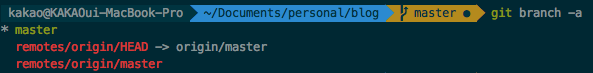
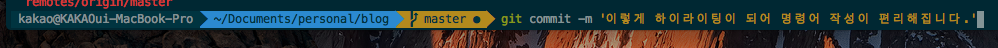
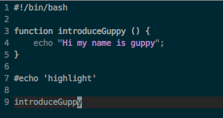
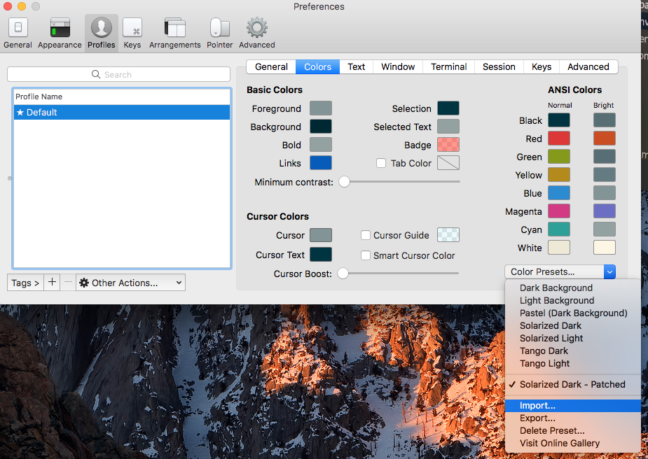
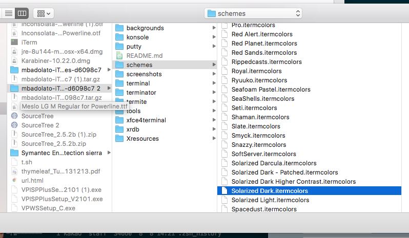

얼마전 이직을 하게되어 새로운 장비(신형 맥북을!!)를 받게 되었습니다.
개발환경을 세팅하며 터미널을 좀 더 편하고 이쁘게 쓰고 싶어 세팅을 해보다가 후에 세팅시 참고 하고자 글을 남기게 되었습니다.

# OSX iterm2 터미널 세팅 가이드

저는 terminal 프로그램으로 ``iterm2``를 사용하고 있습니다.
``iterm2``를 좀 더 편리하게 사용하고자 총 3가지 추가 설정을 해두었습니다.

첫번째로 ``oh-my-zsh`` 테마를 설정해 주었습니다. 이렇게 해주면 제가 현재 위치하고 있는 git branch의
위치를 터미널 상에서 표시해 주어 깃을 관리하기가 편해집니다.



> ``oh-my-zsh``테마 적용시 위의 그림과 같이 git branch를 보여주게 됩니다.

두번째로는 ``zsh-syntax-highlighting``을 적용해주었습니다. 해당 설정을 해주면,
terminal에서 명령어를 입력할때, 하이라이팅이 되어 좀 더 편리하게 명령어를 입력할 수 있게 됩니다.



> 위의 그림처럼 터미널 명령어에 하이라이팅을 해 줍니다.

마지막으로 ``erics_vim_syntax_and_color_highlighting``을 적용하였는데, 해당 설정을 해주면
vim 에서 script 언어에 맞게 하이라이팅을 해주게 됩니다.



> vim에서 script코드를 하이라이팅 해줍니다.

### 사전 작업

위의 세가지 세팅을 하나하나 진행해 보기전에 사전에 설치해주어야 할 부분이 있습니다.(OSX 완전 초기상태라 가정하고 글을 작성하겠습니다.)
먼저 ``iterm2``를 설치해 주어야 합니다. [링크](https://www.iterm2.com/downloads.html)를 통해서 설치를 진행해 주어야 합니다.

그리고 외부 패키지를 설치 할 수 있도록 해주는 ``Homebrew``를 먼저 해줘야합니다.(리눅스에서 ``apt-get``과 유사한 역할이라고 생각하시면 될 것 같습니다.)
[설치가이드 링크](https://brew.sh/index_ko.html)를 참고하여 ``Homebrew``를 설치합니다.

위 두가지 과정을 완료했으면 앞서 설명드린 세가지 추가 설정을 하기 위한 준비는 끝났습니다.
이어서 하나하나 세팅을 진행해 보겠습니다.

### zsh 설치

OSX 초기 상태에서는 ``bash-shell``이 기본 설정으로 되어있습니다.
저희는 ``oh-my-zsh`` 테마를 적용할 것이기 때문에 기본 shell을 ``z-shell``로 수정해주어야 합니다.

먼저 zsh을 설치해 줍니다.

``` shell

> brew install zsh #brew를 통해 zsh 설치
> zsh --version #zsh 설치 확인
zsh 5.3.1 (x86_64-apple-darwin16.6.0)

```

> 위와 같이 설치 ``zsh --version``명령어 실행 후 버전 확인이 되면 zsh 설치가 완료됩니다.

### 기본 shell 변경

``z-shell``설치가 완료되면 기본 shell을 ``z-shell``로 변경해줘야 합니다.
아래 과정을 통해서 기본 shell을 변경해줍니다.

``` shell

> which zsh #zsh 위치 확인
/usr/local/bin/zsh
> chsh -s /usr/local/bin/zsh #기본 쉘 변경
Changing shell for kakao.
Password for kakao:
chsh: /usr/local/bin/zsh: non-standard shell

```

<br/>

``` shell

> echo $SHELL #터미널 재시작후 기본 shell이 zsh로 변경되었는지 확인
/bin/zsh

```

기본 shell을 ``z-shell``로 변경해주었으면, 터미널(iterm2)을 재시작후 정상적으로 변경되었는지 확인합니다.

### oh-my-zsh 적용

위의 과정을 통해서 zsh 설치후 기본쉘을 zsh로 바꾸어 주었으면 ``oh-my-zsh`` 테마를 적용해 보겠습니다.


``` shell

> brew install wget #wget 설치
> wget #설치 확인
wget: missing URL
Usage: wget [OPTION]... [URL]...
> sh -c "$(wget https://raw.github.com/robbyrussell/oh-my-zsh/master/tools/install.sh -O -)"
#oh-my-zsh 설치

```
위의 과정처럼 ``wget``을 설치한 후에 wget을 통해서 ``oh-my-zsh`` 설치를 진행해줍니다.
과정을 모두 진행하고 터미널을 재시작해주면 ``oh-my-zsh``이 적용되어 있을 것입니다.


> [설치가이드 링크](https://github.com/robbyrussell/oh-my-zsh)를 참고하면 자세한 설치과정이 설명돼 있습니다.


이어서 자신이 좋아하는 ``oh-my-zsh 테마``를 적용해 줄 것입니다.
zsh의 설정파일인 ``~/.zshrc``(bash-shell에서는 ~/.bash_profiles)에 ZSH_THEME를 적용해주어야 합니다.

``` shell

# ~/.zshrc 파일에 아래와 같이 테마를 적용

#ZSH_THEME="robbyrussell"
ZSH_THEME="agnoster" #"agnoster"외에도 본인이 원하는 테마 적용 가능

```

<br/>

``` shell

> soruce ~/.zshrc #변경된 설정파일 적용

```

테마 종류는 [테마종류 링크](https://github.com/robbyrussell/oh-my-zsh/wiki/External-themes)를 통해서 더 많이 확인이 가능합니다.
저는 ``agnoster``테마를 적용하여 해당 테마 기준으로 이어서 설명하겠습니다.

### iterm2 테마 설정

위의 과정을 통해서 ``oh-my-zsh``테마를 적용해도 ``iterm2`` 상에서는 아마 이쁘지 않게 보일 것 입니다.
좀 더 이쁘고 보기좋게 하기위해 ``iterm2``에도 어울리는 테마를 설정해 보겠습니다.

[iterm2 테마 다운로드 링크](http://iterm2colorschemes.com/)에서 압축파일을 다운로드후 압축을 풀어줍니다.

아래의 그림과 같이 Profiles설정에서 import를 통해 다운받은 테마를 설정해 import합니다.






> ``agnoster``테마를 적용시 ``Solarized Dark``테마가 가장 잘 어울리는듯해 해당 테마를 적용했습니다.

최종적으로 import한 테마를 적용해 주면 ``iterm2``테마가 적용되게 됩니다.

### font 설정

``oh-my-zsh`` 및 ``iterm2``에 테마를 적용하고 마지막으로 font를 적용해 줘야 합니다.(기존에 사각형 ? 가나오는 등 글씨가 조금 깨져 보였을 것입니다.)
font 설정은 [설정가이드 링크](http://thdev.tech/mac/2016/05/01/Mac-ZSH-Install.html)를 통해서 설정해주면 금방 진행하실 수 있습니다.

### zsh-syntax-highlighting 적용

이제 첫번째 ``oh-my-zsh`` 테마 설정이 끝났습니다. 다음 과정부터는 번거로운 작업이 없이 간단한 설정을 통해서 가능합니다.
이어서 ``zsh-syntax-highlighting``을 적용해 보겠습니다.

``` shell

> brew install zsh-syntax-highlighting

```

brew를 통해서 ``zsh-syntax-highlighting``을 설치해주면 ``/usr/local/share/zsh-syntax-highlighting/zsh-syntax-highlighting.zsh`` 경로에 설치가 됩니다.

~/.zshrc에 하이라이트를 적용해 줍니다.

``` shell

> vim ~/.zshrc
source /usr/local/share/zsh-syntax-highlighting/zsh-syntax-highlighting.zsh
# .zshrc 파일의 마지막 부분에 위의 내용을 붙여넣습니다.

> source ~/.zshrc

```

> [설치가이드 링크](https://github.com/zsh-users/zsh-syntax-highlighting/blob/master/INSTALL.md)를 참고하시면 자세한 설정을 참고하실 수 있습니다.

### erics_vim_syntax_and_color_highlighting 적용

두번째 설정(zsh-syntax-highlighting)은 굉장히 간단하게 설정이 되었습니다.
마지막 설정인 ``erics_vim_syntax_and_color_highlighting``도 매우 간단합니다.

먼저 ``~/.vim`` 경로에 ``erics_vim_syntax_and_color_highlighting``을 클론 받습니다.

``` shell

> cd ~/.vim
> git clone https://github.com/sentientmachine/erics_vim_syntax_and_color_highlighting.git

```

그런 후에 ``~/.vimrc``설정 파일에 아래 문구를 붙여넣어 줍니다.


```
"The following three lines map Ctrl+s to save in vi.  You can comment
"these out, it has nothing to do with syntax highlighting or colors.

" optional lines to turn on pressing F2 to toggle paste mode
noremap <F2> :set invpaste paste?<CR>i
set pastetoggle=<F2>


:nmap <c-s> :w<CR>
:imap <c-s> <Esc>:w<CR>a
:imap <c-s> <Esc><c-s>

syntax on
set background=dark
set hlsearch
set nu
" set smartindent  "smartindent doesn't take care of python hashtag comments correctly, use cindent:    
set cindent
set tabstop=4
set shiftwidth=4
set expandtab
set cursorline
filetype on
filetype plugin indent on

au BufReadPost,BufNewFile *.twig colorscheme koehler
au BufReadPost,BufNewFile *.css colorscheme slate
au BufReadPost,BufNewFile *.js colorscheme slate2
au BufReadPost,BufNewFile *.py colorscheme molokaiyo
au BufReadPost,BufNewFile *.html colorscheme monokai
au BufReadPost,BufNewFile *.java colorscheme monokai
" au BufReadPost,BufNewFile *.php colorscheme monokai

" Default line highlighting for unknown filetypes
hi String ctermfg=140
hi CursorLine ctermbg=235
hi CursorLine guibg=#D3D3D3 cterm=none

"What follows are optional things, I like them

"au BufNewFile,BufRead *.py
"        \ set tabstop=4
"        \ set shiftwidth=4     "aand fedora doesn't like this parameter, remove this line.
"        \ set textwidth=79
"        \ set expandtab
"        \ set autoindent
"        \ set fileformat=unix

" Commenting blocks of code.
" This specifies the comment character when specifying block comments.
"autocmd FileType c,cpp,java,scala let b:comment_leader = '//'
"autocmd FileType sh,ruby,python   let b:comment_leader = '#'
"autocmd FileType conf,fstab       let b:comment_leader = '#'
"autocmd FileType tex              let b:comment_leader = '%'
"autocmd FileType mail             let b:comment_leader = '>'
"autocmd FileType vim              let b:comment_leader = '"'

"this makes it so you can Shift-V highlight lots of text then press ,cc to
"comment it or ,cu to uncomment.  
"noremap <silent> ,cc :<C-B>silent <C-E>s/^/<C-R>=escape(b:comment_leader,'\/')<CR>/<CR>:nohlsearch<CR>
"noremap <silent> ,cu :<C-B>silent <C-E>s/^\V<C-R>=escape(b:comment_leader,'\/')<CR>//e<CR>:nohlsearch<CR>

"This mission critical workaround hack tells vim to restore cursor to the last line.
"Be sure to set: "Thip, crinkle, sploit" to "stopit, just be right".  lolz
"Also it could be the functionality is disabled in your /etc/vim/vimrc or
"your ~/.viminfo is owned by root.  
"http://askubuntu.com/questions/223018/vim-is-not-remembering-last-position
autocmd BufReadPost *
  \ if line("'\"") > 1 && line("'\"") <= line("$") |
  \   exe "normal! g`\"" |
  \ endif

"These extra commands tell syntastic to ignore the following kinds of warnings                                                               
"let g:syntastic_quiet_messages = { "regex": 'superfluous' }
"let g:syntastic_quiet_messages = { "regex": 'superfluous-parens\|too-many-instance-attributes\|too-few-public-methods' }

"I like the vertical bar on insert mode, others do not like.  You decide.
"let &t_SI = "\<Esc>]50;CursorShape=1\x7" " Vertical bar in insert mode
"let &t_EI = "\<Esc>]50;CursorShape=0\x7" " Block in normal mode
```


마지막으로 ``~/.zshrc``설정 파일에 아래 문구를 붙여 넣고 설정파일을 적용해 주면 설정이 모두 완료되게 됩니다.

``` shell

TERM=xterm-256color

```

<br/>

``` shell

> soruce ~/.zshrc

```

> [설치가이드 링크](https://github.com/sentientmachine/erics_vim_syntax_and_color_highlighting)를 참고하시면 더 자세한 설명이 있습니다.


# 마치며

이렇게 모든 설정을 하게되면 초기보다 훨씬 이쁘고 사용하기 편리한 terminal 환경이 구축 되었을 것입니다.
저도 맥을 사용한지 오래되지 않아 아직 터미널 환경에 많이 익숙하지 않습니다. 설정과정 중 불필요한 설정이 있거나 잘못된 설정이 있을 수도 있습니다.
아래 참고 링크를 통해서 최대한 설정을 해주었습니다. 혹시나 제가 설정한 부분에서 문제가 있는 사항이 있으면 편하게 말씀 나누었으면 좋겠습니다.


## 참고 링크

- iterm2 다운로드 링크 : [https://www.iterm2.com/downloads.html](https://www.iterm2.com/downloads.html)
- homebrew 설치 가이드 링크 : [https://brew.sh/index_ko.html](https://brew.sh/index_ko.html)
- oh-my-zsh 링크 : [https://github.com/robbyrussell/oh-my-zsh](https://github.com/robbyrussell/oh-my-zsh)
- 꿈 낳은 개발자가 되자 블로그 : [https://github.com/zsh-users/zsh-syntax-highlighting/blob/master/INSTALL.md]https://github.com/zsh-users/zsh-syntax-highlighting/blob/master/INSTALL.md
