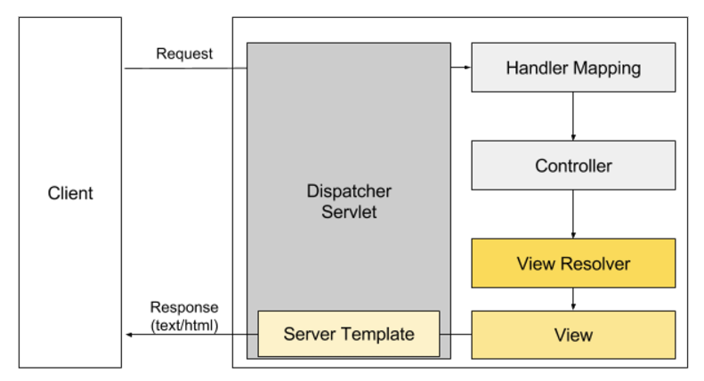
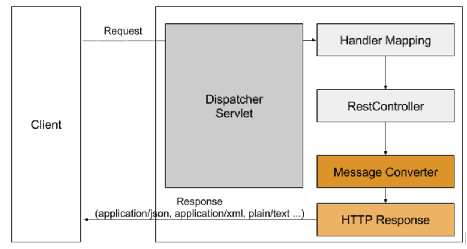

사내에서 프로젝트를 진행하며 @RestController를 이용하여 클라이언트에게 JSON 응답을 내려주어야 하는 코드를 작성해야 했습니다.
기존의 의존성에서는 org.codehaus.jackson 을 이용하고 있어 해당 의존성을 com.fasterxml.jackson.core 으로 바꿔주게 되었습니다.
이 과정에서 알게된 점과 @RestController가 무엇을 이용하여 어떤식으로 동작하는지에 대해서 정리하고자 합니다.

# @RestController의 동작방식

@RestController 는 @Controller 어노테이션과 @ResponseBody 어노테이션을 합쳐놓은 어노테이셥 입니다.
클래스 상단에 @RestController 어노테이션을 선언하면 아래의 코드와 동일하게 동작하게 됩니다.

```java
@Controller
@RequestMapping("/rests")
public class JacksonController {

  @GetMapping("/text")
  @ResponseBody
  public String getPlainText () {
    return "Hello, guppy";
  }

}
```

@RestController 가 어떤 역할을 하는지는 알았으나, 일반적인 @Controller 어노테이션과 @RestController 어노테이션에는 어떤차이가 있는지 알아봐야 할 것 같습니다.
스프링 프레임워크는 일반적으로 view 이름을 리턴해주어 사용자에게 뷰를 통해서 출력되게 되어있습니다. 아래의 그림을 보면 어떤 흐름으로 동작하는지 볼 수 있습니다.



> 사용자의 요청이 오면 등록된 ``ViewResolver``를 통해 서버 템플릿을 하여 사용자에게 text/html 타입의 응답을 보내주게됩니다.

<br/>
```java
@Controller
public class IndexController {

    @GetMapping("/")
    public String index () {
       // ViewResolver에 등록된 template resource 패스를 확인하여 서버 템플릿후 text/html 컨텐츠 타입을 리턴
       return "index";
    }

}
```

그에 반해 @RestController 에서 return 되는 값은 view를 통해서 출력되는 것이 아니라 HTTP ResponseBody에 직접 쓰여지게 됩니다.
아래의 그림을 보면 어떤 흐름으로 동작하는지 볼 수 있습니다.



> 사용자의 요청이 오면 등록된 ``MessageConverter``를 통해서 application/json, text/plain 등 알맞은 형태의 읍답형태로 리턴되게 됩니다.

<br/>
```java
@RestController
@RequestMapping("/students")
public class StudentRestController {

    private final StudentService studentService;

    @Autowired
    public StudentRestController(StudentService studentService) {
        this.studentService = studentService;
    }

    @GetMapping("/one")
    public ResponseEntity<Student> getStudent () {
        // MappingJackson2HttpMessageConverter 를 통해서 application/json 컨텐츠 타입을 리턴
        return studentService.getStudent();
    }

    @GetMapping("/text")
    public String getText () {
        // StringHttpMessageConverter 를 통해서 text/plain 컨텐츠 타입을 리턴
        return "guppy.kang";
    }
}
```

정리하자면 @ResponseBody 어노테이션은 값을 리턴할 타입을 보고 알맞은 ``MessageConverter``를 찾아서 적절한 응답형태로 변환해준 후 Http ResponseBody에 직접 쓰여 응답을 해주는 것입니다.

적절한 응답을 해주기 위해 응답을 바꿔주는 MessageConverter 들은 ``HttpMessageConverter`` 인터페이스를 상속받고 있습니다.
[[출처]('https://docs.spring.io/spring-framework/docs/current/javadoc-api/org/springframework/http/converter/HttpMessageConverter.html')]

몇가지 대표적인 응답해주는 MessageConverter들은 아래와 같은 종류가 있습니다.

- application/json 형태의 응답 : ``MappingJackson2HttpMessageConverter`` [[출처]('https://docs.spring.io/spring-framework/docs/current/javadoc-api/org/springframework/http/converter/json/MappingJackson2HttpMessageConverter.html')]

- application/xml 또는 text/xml 형태의 응답 : ``MarshallingHttpMessageConverter`` [[출처]('https://docs.spring.io/spring-framework/docs/current/javadoc-api/org/springframework/http/converter/xml/MarshallingHttpMessageConverter.html')]

이 외에도 다양한 종류의 응답형태로 변환 해주는 MessageConverter가 있습니다. 원하는 형태의 응답을 할때 필요한 MessageConverter 설정을 추가해 주면 될 것입니다. (스프링 부트 기반에서는 대부분의 MessageConverter를 ``spring-boot-starter-web`` 의존성을 통해서 자동으로 세팅해줍니다.)

이번 포스팅에서 저는 응답형태를 application/json 형태로 바꿔주는 ``MappingJackson2HttpMessageConverter`` 위주로 설명을 진행하고자 합니다.
``MappingJackson2HttpMessageConverter``가 어떤 방식으로 동작하는지 (부트가 세팅을 해주지만..) 설정을 다시 잡아보면서 따라가보고자 합니다.

# org.codehaus.jackson VS com.fasterxml.jackson.core

설정 세팅에 들어가기 앞서 json 형태의 Http 응답으로 바꿔주기 위한 라이브러리는 대표적으로 2가지가 존재합니다.

첫번째는 ``org.codehaus.jackson``이고 두번째는 ``com.fasterxml.jackson.core``입니다.

결론부터 말씀드리면 ``com.fasterxml.jackson.core`` 라이브러리를 사용해야 한다는 것입니다. ``org.codehaus.jackson``는 관리가 안되고 있는 라이브러리이며 그에 반해, ``com.fasterxml.jackson.core``는 현재까지도 꾸준히 관리되는 라이브러리이기 때문에 후자의 라이브러리를 사용하기를 권장합니다.

(포스팅에서도 ``com.fasterxml.jackson.core`` 라이브러리를 사용하여 설명을 진행하겠습니다. 만일 진행하시고 계시는 프로젝트의 버전이 오래되어 codehaus 라이브러리를 사용하시고 계시다면 fasterxml 라이브러리 또한 2.4 버전까지는 자바 1.6까지 지원이 가능하니 마이그레이션을 권장합니다.)

> Support for oldest Android versions (2.x) will not be continued, as **Jackson modules may use full feature set of JDK 1.6.**

[[출처](https://github.com/FasterXML/jackson/wiki/Jackson-Release-2.4)] Jackson Release 2.4 Note


> **Difference between fasterxml Jackson and codehaus**:
They are the two major branches of Jackson, and also the two versions of different packages.Jackson starts to use the new package name fasterxml; the 1.x version of the package name isCodehaus. In addition to the package name is different, their Maven ID artifact is also different. 1.x version is currently only available for bug-fix, while the 2.x version is still in development and release. If it is a new project, it is recommended to use 2x directly, that is, Jackson fasterxml.

[[출처](http://prog3.com/sbdm/blog/clementad/article/details/46416647)] The difference between fasterxml Jackson and codehaus (vs. codehaus fasterxml)


# com.fasterxml.jackson.core의 의존성

fasterxml.jackson의 의존성은 크게 3가지를 가지고 있습니다.

> Core modules
  Core modules are the foundation on which extensions (modules) build upon. There are 3 such modules currently (as of Jackson 2.x):
  - Streaming (docs) ("jackson-core") defines low-level streaming API, and includes JSON-specific implementations
  - Annotations (docs) ("jackson-annotations") contains standard Jackson annotations
  - Databind (docs) ("jackson-databind") implements data-binding (and object serialization) support on streaming package; it depends both on streaming and annotations packages

[[출처](https://github.com/FasterXML/jackson)] Jackson Project Home @github

``jackson-core``, ``jackson-annotations`` 모듈 그리고 jackson-databind 모듈입니다. 각각의 역할을 위의 출처를 참고하시면 될 것 같습니다.
중요한점은 마지막 모듈인 ``jackson-databind`` 모듈이 상위 2가지 모듈의 의존성을 포함하기 때문에, 웬만하면 ``jackson-databind`` 모듈 의존성만 추가해주시면 됩니다.

# spring boot 기반에서의 com.fasterxml.jackson.core 세팅

https://springframework.guru/jackson-dependency-issue-spring-boot-maven/

# 어떻게 동작하는가 (샘플코드로 가이드)

- 제이슨 내려줄 샘플 서버 (노드)
https://github.com/wckhg89/node_server_for_jackson_exmple

- 테스트 코드 기반으로 rest flow 태워보는 샘플
https://github.com/wckhg89/jackson_sample

# 마치며


## 참고링크

http://mkil.tistory.com/204

http://www.nextree.co.kr/p11205/

http://highcode.tistory.com/24
