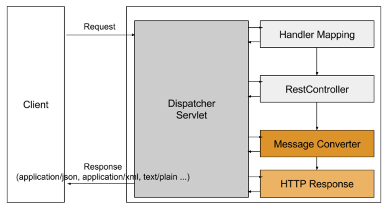

사내에서 프로젝트를 진행하며 @RestController를 이용하여 클라이언트에게 JSON 응답을 내려주어야 하는 코드를 작성해야 했습니다.
기존의 의존성에서는 org.codehaus.jackson 을 이용하고 있어 해당 의존성을 com.fasterxml.jackson.core 으로 바꿔주게 되었습니다.
이 과정에서 알게된 점과 @RestController가 무엇을 이용하여 어떤식으로 동작하는지에 대해서 정리하고자 합니다.

# @RestController의 동작방식

@RestController 는 @Controller 어노테이션과 @ResponseBody 어노테이션을 합쳐놓은 어노테이셥 입니다.
클래스 상단에 @RestController 어노테이션을 선언하면 아래의 코드와 동일하게 동작하게 됩니다.

```java
@Controller
@RequestMapping("/rests")
public class JacksonController {

  @GetMapping("/text")
  @ResponseBody
  public String getPlainText () {
    return "Hello, guppy";
  }

}
```

@RestController 가 어떤 역할을 하는지는 알았으나, 일반적인 @Controller 어노테이션과 @RestController 어노테이션에는 어떤차이가 있는지 알아봐야 할 것 같습니다.
스프링 프레임워크는 일반적으로 view 이름을 리턴해주어 사용자에게 뷰를 통해서 출력되게 되어있습니다. 아래의 그림을 보면 어떤 흐름으로 동작하는지 볼 수 있습니다.


> 사용자의 요청이 오면 등록된 ``ViewResolver``를 통해 서버 템플릿을 하여 사용자에게 text/html 타입의 응답을 보내주게됩니다.

```java
@Controller
public class IndexController {

    @GetMapping("/")
    public String index () {
       // ViewResolver에 등록된 template resource 패스를 확인하여 서버 템플릿후 text/html 컨텐츠 타입을 리턴
       return "index";
    }

}
```

그에 반해 @RestController 에서 return 되는 값은 view를 통해서 출력되는 것이 아니라 HTTP ResponseBody에 직접 쓰여지게 됩니다.
아래의 그림을 보면 어떤 흐름으로 동작하는지 볼 수 있습니다.



> 사용자의 요청이 오면 등록된 ``MessageConverter``를 통해서 application/json, text/plain 등 알맞은 형태의 읍답형태로 리턴되게 됩니다.

```java
@RestController
@RequestMapping("/students")
public class StudentRestController {

    private final StudentService studentService;

    @Autowired
    public StudentRestController(StudentService studentService) {
        this.studentService = studentService;
    }

    @GetMapping("/one")
    public ResponseEntity<Student> getStudent () {
        // MappingJackson2HttpMessageConverter 를 통해서 application/json 컨텐츠 타입을 리턴
        return studentService.getStudent();
    }

    @GetMapping("/text")
    public String getText () {
        // StringHttpMessageConverter 를 통해서 text/plain 컨텐츠 타입을 리턴
        return "guppy.kang";
    }
}
```

정리하자면 @ResponseBody 어노테이션은 값을 리턴할 타입을 보고 알맞은 ``MessageConverter``를 찾아서 적절한 응답형태로 변환해준 후 Http ResponseBody에 직접 쓰여 응답을 해주는 것입니다.

적절한 응답을 해주기 위해 응답을 바꿔주는 MessageConverter 들은 ``HttpMessageConverter`` 인터페이스를 상속받고 있습니다.
[[출처]('https://docs.spring.io/spring-framework/docs/current/javadoc-api/org/springframework/http/converter/HttpMessageConverter.html')]

몇가지 대표적인 응답해주는 MessageConverter들은 아래와 같은 종류가 있습니다.

- application/json 형태의 응답 : ``MappingJackson2HttpMessageConverter`` [[출처]('https://docs.spring.io/spring-framework/docs/current/javadoc-api/org/springframework/http/converter/json/MappingJackson2HttpMessageConverter.html')]

- application/xml 또는 text/xml 형태의 응답 : ``MarshallingHttpMessageConverter`` [[출처]('https://docs.spring.io/spring-framework/docs/current/javadoc-api/org/springframework/http/converter/xml/MarshallingHttpMessageConverter.html')]

이 외에도 다양한 종류의 응답형태로 변환 해주는 MessageConverter가 있습니다. 원하는 형태의 응답을 할때 필요한 MessageConverter 설정을 추가해 주면 될 것입니다. (스프링 부트 기반에서는 대부분의 MessageConverter를 ``spring-boot-starter-web`` 의존성을 통해서 자동으로 세팅해줍니다.)

이번 포스팅에서 저는 응답형태를 application/json 형태로 바꿔주는 ``MappingJackson2HttpMessageConverter`` 위주로 설명을 진행하고자 합니다.
``MappingJackson2HttpMessageConverter``가 어떤 방식으로 동작하는지 (부트가 세팅을 해주지만..) 설정을 다시 잡아보면서 따라가보고자 합니다.

# org.codehaus.jackson VS com.fasterxml.jackson.core

http://prog3.com/sbdm/blog/clementad/article/details/46416647

# com.fasterxml.jackson.core의 의존성

https://github.com/FasterXML/jackson

# spring boot 기반에서의 com.fasterxml.jackson.core 세팅

https://springframework.guru/jackson-dependency-issue-spring-boot-maven/

# 어떻게 동작하는가 (샘플코드로 가이드)

- 제이슨 내려줄 샘플 서버 (노드)
https://github.com/wckhg89/node_server_for_jackson_exmple

- 테스트 코드 기반으로 rest flow 태워보는 샘플
https://github.com/wckhg89/jackson_sample

# 마치며


## 참고링크

http://mkil.tistory.com/204

http://www.nextree.co.kr/p11205/

http://highcode.tistory.com/24
